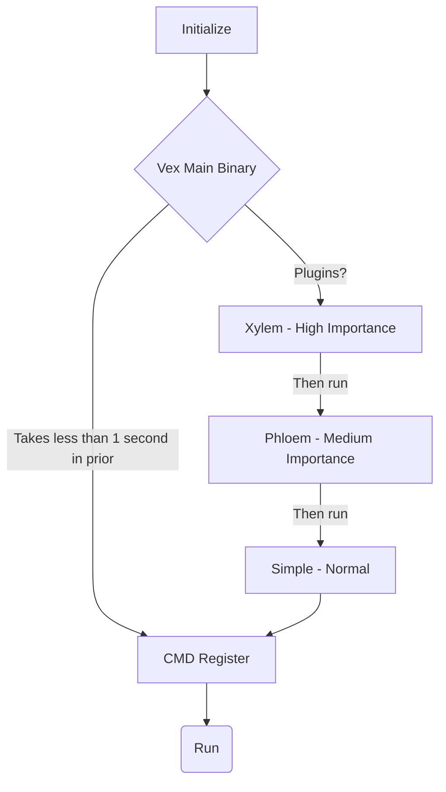

##   Vex
is an extensive Free Crossplatform Qt C++ Text Editor.
With a unique architecture and lightweight and faster experience in mind

---

# Download
Current version is 4.1 ( Cytoplasm )
for download guide check

https://github.com/zynomon/vex/wiki/Download

https://github.com/zynomon/vex/wiki/Compile

https://github.com/zynomon/vex/wiki/Install

# Features
## Find & Replace

Case-sensitive search, Whole word matching , Replace one or all Search wraps around document

# Build

