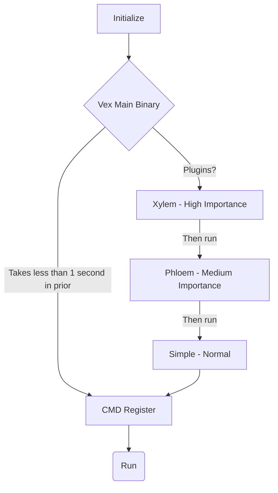

##   Vex <sub>4.1</sub>


Vex is an extensive Free Crossplatform C++ Text Editor.
With a unique Plugin architecture, lightweight and faster experience in mind


> *if this looks ugly to you , you can theme it, every aspect is themable.*

---

# Download
Current version is 4.1 ( Cytoplasm )
| Platform | Download |
|----------|----------|
| [](#) Windows Installer | [`Vex_4.1_Setup.exe`](https://github.com/zynomon/vex/releases/download/4.1-cytoplasm/Vex_4.1_Setup.exe) (16.1 MB) |
| [](#) Windows Zstd 7z | [`vex_4.1_Cytoplasm_WIN32.7z`](https://github.com/zynomon/vex/releases/download/4.1-cytoplasm/vex_4.1_Cytoplasm_WIN32.7z) (10.8 MB) |
| [](#) AppImage ( Linux Universal ) | [`vex_4.1_Cytoplasm_x86_64.AppImage`](https://github.com/zynomon/vex/releases/download/4.1-cytoplasm/vex_4.1_Cytoplasm_x86_64.AppImage) (3.94 MB) |
| [](#) Debian/Ubuntu (.deb) | [`vex_4.1_Cytoplasm_x86_64.deb`](https://github.com/zynomon/vex/releases/download/4.1-cytoplasm/vex_4.1_Cytoplasm_x86_64.deb) (134 KB) |
| [](#) Fedora/RHEL (.rpm) | [`vex_4.1_Cytoplasm_x86_64.rpm`](https://github.com/zynomon/vex/releases/download/4.1-cytoplasm/vex_4.1_Cytoplasm_x86_64.rpm) (213 KB) |
| [](#) FreeBSD Package | [`vex-4.1_Cytoplasm.pkg`](https://github.com/zynomon/vex/releases/download/4.1-cytoplasm/vex-4.1_Cytoplasm.pkg) (546 B) |
| [](#) FreeBSD Zstd Tarball | [`vex_4.1_Cytoplasm_FREEBSD.tar.zst`](https://github.com/zynomon/vex/releases/download/4.1-cytoplasm/vex_4.1_Cytoplasm_FREEBSD.tar.zst) (193 KB) |
| [](#) GNU/Linux Zstd Tarball | [`vex_4.1_Cytoplasm.tar.zst`](https://github.com/zynomon/vex/releases/download/4.1-cytoplasm/vex_4.1_Cytoplasm.tar.zst) (145 KB) |

# For Installing check:

https://github.com/zynomon/vex/wiki/Install
Its avilable for windows, FreeBSD, And any Linux Distro ( APPIMAGE +  DEB + RPM + TARGZ ),
Except Mac for now.

# Features

## Find & Replace


Case-sensitive search, Whole word matching , Replace one or all Search wraps around document
Keybind : ``CRTL+F``

## Open by name
open by name gives the feeling of 
```bash
 ~/.bashrc # this opens a file named  bashrc in  vi 
``` 
if file doesnt exists it creates it
you  have to specify the path of which file you want to open.
it has  auto-completion to help reduce typos. 


- Keybind : ``CRTL+O``


## Syntax engine


Vex uses an independent syntax definition Language for defining syntax, its made for coloring keywords heriodics and delimiters are supported.
written Entirely in c++ check 
https://github.com/zynomon/vex/wiki/Syntax 
to know more
## Plugin system
instead of like normal application   click and run , we used plugin system




# Build

Vex uses Qt framework so surely its possible to be compiled in any linux distro , MAC, newer windows versions ( VISTA ONWARDS 11 ), 
vex doesnt relies on any other libraries making the build system take lesser space Than an entire chromium engine, 
https://github.com/zynomon/vex/wiki/Compile

# Fork
Vex is an opensource project its easy to be forked with its Build system 

For forking check [ https://github.com/zynomon/vex/wiki/Compile](https://github.com/zynomon/vex/wiki/Compile#creating-distribution-packages)


Script and Batch files were made to save times  instead of wasting on building for other oses
Scripts are capable of creating a package

