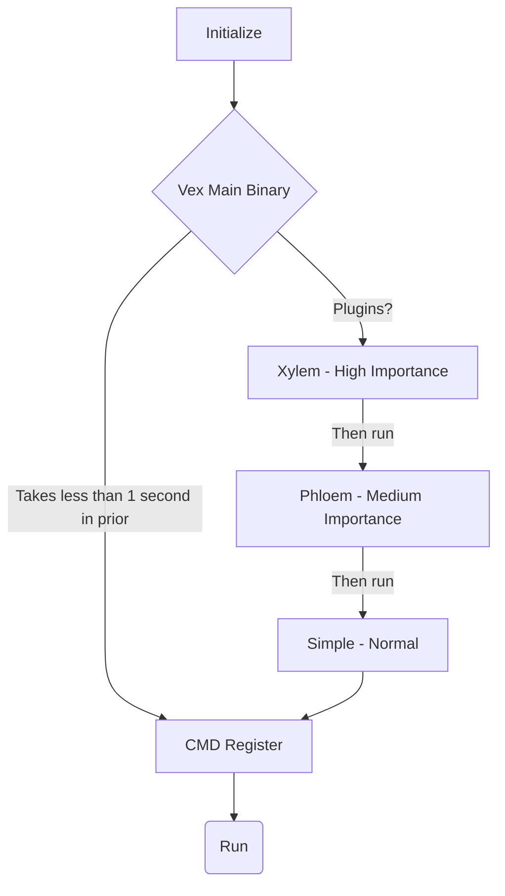

# #   Vex
is an extensive Free Crossplatform Qt C++ Text Editor.
With a unique architecture and lightweight and faster experience in mind

---

```mermaid
graph TD
  direction TB
  A[Initialize] --> C{Vex Main Binary}
  
  C --> |Takes less than 1 second in prior| X[CMD Register]
  C --> |Plugins?| D[Xylem - High Importance]
  
  D --> |Then run| E[Phloem - Medium Importance]
  E --> |Then run| Y[Simple - Normal]
  
  Y --> X
  X --> e(Run)

```
