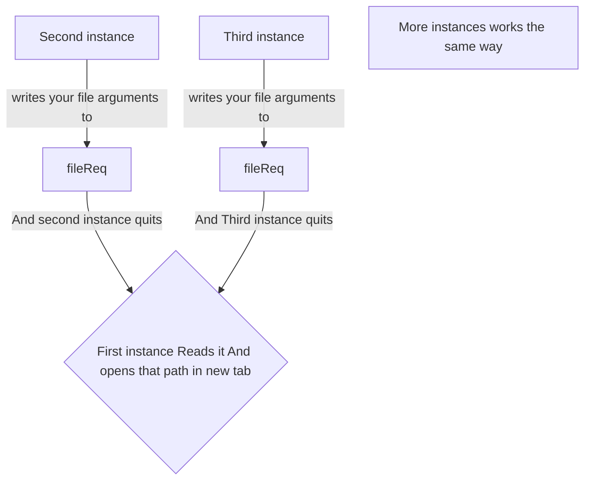

# Current Version is 4.1
Here are Some issues listed with their fixes

- [# Vex Closing when trying to open?](#vex-closing-itself-and-why)
- [# User icon not working?](#the-user-icon)
- [# "Vex#QSS" is not working?](#vexqss-not-working)
- [# Session restore is not working?](#session-restore)
- [# Can't switch modes from Vi mode?](#cant-switch-modes-in-vi-mode)
- [# Vex isn't showing an editor just an icon?](#no-editor-is-showing-up)
- [# QCommandLineParser issue](#linuxunix-only-issue)

---

# Vex Closing itself and why?


Vex uses fileReq for requesting files, its a workaround for not using QNetwork library in order to achieve single instance logic, so the logic is



*Note: fileReq is located in your Vex config folder (~/.vex/.temp/)*

so when your PC gets shut down immediately or Vex gets killed by some Task manager it can leave that "fileReq" intact that causes next instance to think that it's secondary instance and it needs to writes to fileReq instead of working like first one

## How to fix it?

fix is simple just remove the ~/.vex/.temp/fileReq

vex will open again, its not a memory management issue. it's just the logic is incomplete. we will add some fixes and patches to this in next version.

---

# The User icon

In version 4.1 the user icon system is incomplete but the system icon works perfectly


## fix?

Currently we are working on more robust solution for icon handling. Current user icon applying logic is incomplete.


---

# Vex#QSS not working?


Vex#QSS block seems to not work in current version its because of properly connecting logics but not consistently. I apologize for the inconvenience. Soon we will make it work , wait for more latest releases.

---


# Session restore

Current Session restore logic is fragile and its hard to work with it

## fix?

don't rely on session restore for now , we will also make a path for it as soon as possible

---

# Can't Switch modes in vi mode?


you can switch from vi mode by pressing some keys but current vi mode is very minimally implemented.

## fix?

use vi mode switching from qmenubar


---

# No editor is showing up

If you execute vex and not find any editor/menu bar/status bar and see just an icon , that means no plugins are loaded . here is a demo


## fix?

The fix is simple, just keep the VexCore/LookAndFeelCore.so or .dll to where your binary for vex exists as for linux it's in /bin/vex it's not recommended to use that . instead you can make a folder in usr share and paste all .so and /bin/vex and then link the "vex" to /bin/ so everything stays same,

### How would you find those .so or .dll pre compiled?

using our zstd compressed packages

| Type | Download |
|----------|----------|
| [](#) GNU/Linux Zstd Tarball | [`vex_4.1_Cytoplasm.tar.zst`](https://github.com/zynomon/vex/releases/download/4.1-cytoplasm/vex_4.1_Cytoplasm.tar.zst) (145 KB) |
| [](#) FreeBSD Zstd Tarball | [`vex_4.1_Cytoplasm_FREEBSD.tar.zst`](https://github.com/zynomon/vex/releases/download/4.1-cytoplasm/vex_4.1_Cytoplasm_FREEBSD.tar.zst) (193 KB) |
| [](#) Windows Zstd 7z | [`vex_4.1_Cytoplasm_WIN32.7z`](https://github.com/zynomon/vex/releases/download/4.1-cytoplasm/vex_4.1_Cytoplasm_WIN32.7z) (10.8 MB) |

check `/usr/lib/vex` folder or any .so file in the area and as for windows look for .dll files with those exact names also if you got any issues of dll couldn't be loaded, you can get your fix from this. by default vex never writes anything in the directory its being installed so it doesnt matters your config and data saved in ~/.vex/

---


# Linux/Unix only issue

This issue only occurs when you have installed Vex globally and are trying to execute a Vex binary that is in the same directory as the plugins.

Windows installation stays compact, while Linux's implementation installs it to the lib directory.


```
zynomon@debian:~/Desktop$ /home/zynomon/Desktop/vex 
QCommandLineParser: already having an option named "f"
QCommandLineParser: already having an option named "file" <--- Registering the vex initialization twice 
zynomon@debian:~/Desktop$ sudo rm -rf /usr/lib/vex <-- immediate fix but not reliable; make sure to link the binary to /bin and keep libs and binary in opt or usr/share, that is more reliable
zynomon@debian:~/Desktop$ vex
```

## Why this issue?

The main reason is `VexCore.so` is being loaded twice.

Looking at the source code in `PlugVex.H`, the `PluginLoader` class defines multiple plugin search paths:

```cpp
QStringList paths;
paths << QCoreApplication::applicationDirPath();

#if defined(Q_OS_UNIX) && !defined(Q_OS_DARWIN)
paths << "/usr/lib/vex";
#endif
```

When Vex is installed globally, the plugins exist in `/usr/lib/vex`. If you also run a Vex binary from a location that contains plugins (like your Desktop or a build directory), the loader finds and loads plugins from **both locations**:

1. The current directory (`applicationDirPath()`)
2. The system directory (`/usr/lib/vex`)

This causes duplicate initialization, resulting in the `QCommandLineParser` errors shown above.

because VexCore registers -f --file argument and if you do it two times it will be nothing but ambiguous

However, this is not a reliable long-term fix. The proper solution is to keep your plugins and binary together in a single location (like `/opt/vex` or `/usr/share/vex`) and link the binary to `/bin` so everything stays consistent.

---

## Still having issues?
Report bugs at: https://github.com/zynomon/vex/issues
Make sure to help us by contributions and thanks for using Vex  regardless of issues .