 
***# Vex Core Plugin API***
<hr>
 
**V**ex 4.0 introduced a revolutionary plugin architecture that transformed Vex from a monolithic application into a modular, extensible system. The Core Plugin API enables developers to extend Vex's functionality through dynamically loaded shared libraries.
 
The plugin system is defined in `Plugvex.H` and orchestrated by the `PluginLoader` class, which handles plugin discovery, loading, initialization, and lifecycle management.
> *Icon by Oxygen theme KDE*
<p>
‎ 
‎ 
‎ 
‎ ‎ 

</p>
 
---
 
# Table of Contents
 
1. [Plugin System Overview](#1-plugin-system-overview)
   - [1.1 What Are Core Plugins?](#11-what-are-core-plugins)
   - [1.2 Plugin Architecture](#12-plugin-architecture)
   - [1.3 Plugin Lifecycle](#13-plugin-lifecycle)
   - [1.4 Plugin vs Monolithic Design](#14-plugin-vs-monolithic-design)
 
2. [Plugin Importance Tiers](#2-plugin-importance-tiers)
   - [2.1 Xylem Plugins](#21-xylem-plugins)
   - [2.2 Phloem Plugins](#22-phloem-plugins)
   - [2.3 Simple Plugins](#23-simple-plugins)
   - [2.4 Initialization Order](#24-initialization-order)
 
3. [CorePlugin Interface](#3-coreplugin-interface)
   - [3.1 Interface Definition](#31-interface-definition)
   - [3.2 PluginMetadata Structure](#32-pluginmetadata-structure)
   - [3.3 Required Methods](#33-required-methods)
   - [3.4 Initialization Parameters](#34-initialization-parameters)
 
4. [Creating a Core Plugin](#4-creating-a-core-plugin)
   - [4.1 Plugin File Structure](#41-plugin-file-structure)
   - [4.2 Basic Plugin Template](#42-basic-plugin-template)
   - [4.3 Build Configuration (CMake)](#43-build-configuration-cmake)
   - [4.4 Plugin Metadata](#44-plugin-metadata)
   - [4.5 Qt Plugin System Integration](#45-qt-plugin-system-integration)
 
5. [Plugin Discovery and Loading](#5-plugin-discovery-and-loading)
   - [5.1 Plugin Search Paths](#51-plugin-search-paths)
   - [5.2 Platform-Specific Extensions](#52-platform-specific-extensions)
   - [5.3 Loading Process](#53-loading-process)
   - [5.4 Error Handling](#54-error-handling)
 
6. [Command Line Interface (CmdLine)](#6-command-line-interface-cmdline)
   - [6.1 CmdLine System](#61-cmdline-system)
   - [6.2 Adding Commands](#62-adding-commands)
   - [6.3 Parsing Arguments](#63-parsing-arguments)
   - [6.4 Accessing Values](#64-accessing-values)
   - [6.5 Flag Arguments](#65-flag-arguments)
 
7. [Accessing Vex Components](#7-accessing-vex-components)
   - [7.1 MainWindow Access](#71-mainwindow-access)
   - [7.2 Finding Child Widgets](#72-finding-child-widgets)
   - [7.3 Settings System](#73-settings-system)
   - [7.4 Menu Integration](#74-menu-integration)
   - [7.5 Status Bar Integration](#75-status-bar-integration)
 
8. [Built-in Core Plugins](#8-built-in-core-plugins)
   - [8.1 VexCore Plugin](#81-vexcore-plugin)
   - [8.2 SyntaxCore Plugin](#82-syntaxcore-plugin)
   - [8.3 LookAndFeelCore Plugin](#83-lookandfeelcore-plugin)
 
9. [Advanced Plugin Development](#9-advanced-plugin-development)
   - [9.1 Inter-Plugin Communication](#91-inter-plugin-communication)
   - [9.2 Qt Signals and Slots](#92-qt-signals-and-slots)
   - [9.3 Event System Integration](#93-event-system-integration)
   - [9.4 File Watching](#94-file-watching)
   - [9.5 Dynamic UI Creation](#95-dynamic-ui-creation)
 
10. [Plugin Possibilities](#10-plugin-possibilities)
    - [10.1 Editor Extensions](#101-editor-extensions)
    - [10.2 Language Support](#102-language-support)
    - [10.3 Version Control Integration](#103-version-control-integration)
    - [10.4 Build System Integration](#104-build-system-integration)
    - [10.5 Terminal Integration](#105-terminal-integration)
    - [10.6 Project Management](#106-project-management)
    - [10.7 Code Intelligence](#107-code-intelligence)
    - [10.8 Debugging](#108-debugging)
 
11. [Debug Mode](#11-debug-mode)
    - [11.1 Enabling Debug Mode](#111-enabling-debug-mode)
    - [11.2 Debug Output](#112-debug-output)
    - [11.3 Error Dialogs](#113-error-dialogs)
 
12. [Troubleshooting](#12-troubleshooting)
    - [12.1 Plugin Not Loading](#121-plugin-not-loading)
    - [12.2 Initialization Failures](#122-initialization-failures)
    - [12.3 Crashes and Isolation](#123-crashes-and-isolation)
    - [12.4 Build Issues](#124-build-issues)
 
---
 
## 1. Plugin System Overview
 
### 1.1 What Are Core Plugins?
 
**Core Plugins** are dynamically loaded shared libraries (.so on Linux, .dll on Windows, .dylib on macOS) that extend Vex's functionality. Each plugin implements the `CorePlugin` interface and is loaded at application startup.
 
**Key Characteristics:**
- **Dynamic Loading**: Loaded at runtime via Qt's plugin system
- **Isolated**: Each plugin runs in isolation; crashes don't affect other plugins
- **Modular**: Core functionality is divided into separate plugins
- **Extensible**: New features can be added without modifying Vex core
- **Version-Specific**: Plugins declare interface version (`"vex.core/4.0"`)
 
**Core vs User Plugins:**
- **Core Plugins**: Built with Vex, installed system-wide, fundamental features
- **User Plugins** *(Future)*: User-created, installed to `~/.vex/plugins/`, optional extensions
 
---
 
### 1.2 Plugin Architecture
 
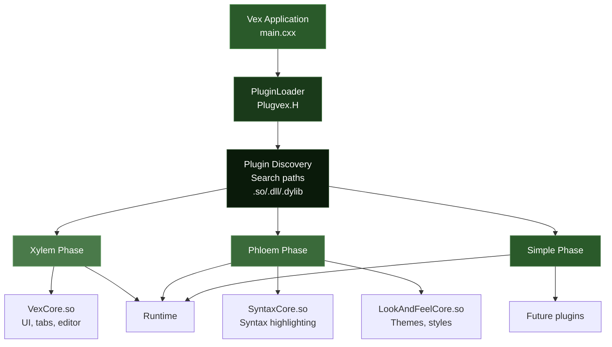
 
---
 
### 1.3 Plugin Lifecycle
 
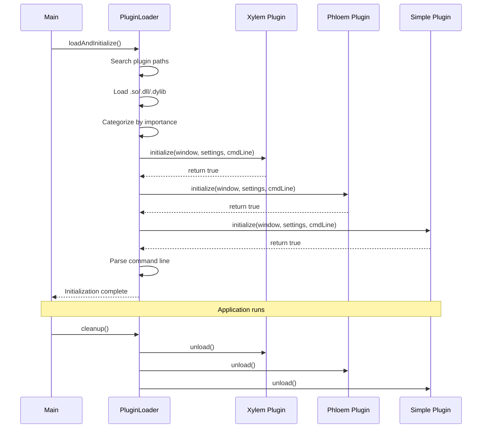
 
---
 
### 1.4 Plugin vs Monolithic Design
 
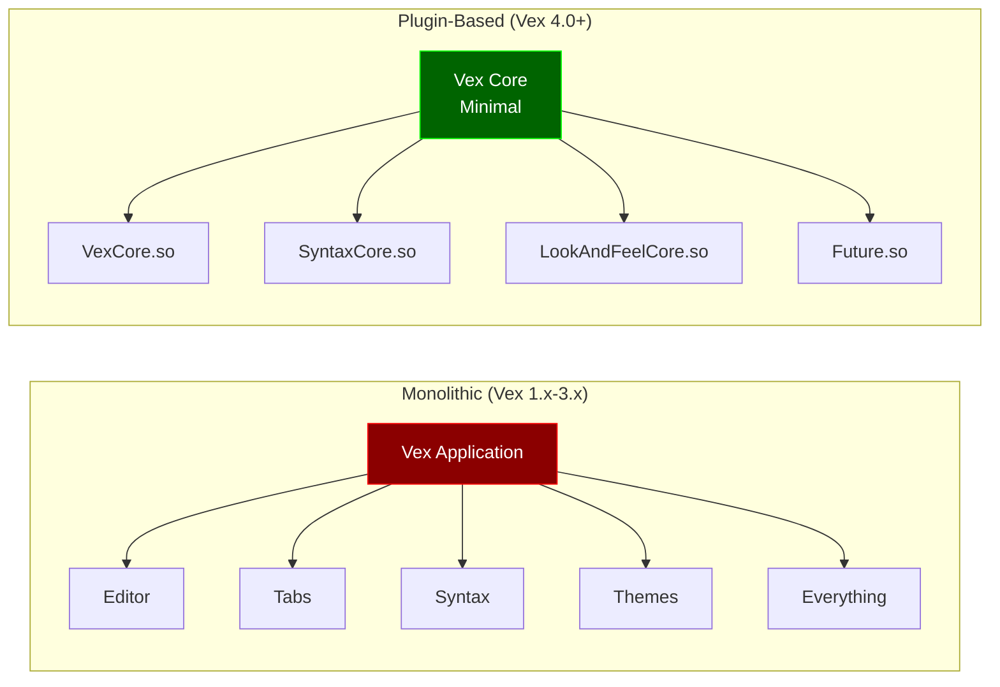
 
---
 
## 2. Plugin Importance Tiers
 
### 2.1 Xylem Plugins
 
**Definition:** Xylem (木部 - wood tissue that transports water upward) plugins are **structural** plugins that provide essential UI components.
 
**Characteristics:**
- **First to initialize**
- Provide fundamental UI structure
- Other plugins depend on them
- Critical to application function
 
**Example: VexCore**
```cpp
PluginMetadata meta() const override {
    PluginMetadata metadata;
    metadata.importance = PluginMetadata::Xylem;  // Structural
    return metadata;
}
```
 
**Responsibilities:**
- Create main UI widgets (tab system, editor widgets)
- Set up central widget
- Provide object names for other plugins to find
- Establish application structure
 
**Why "Xylem"?**
Just as xylem tissue forms the structural core of a plant and transports essential resources upward, Xylem plugins form the structural core of Vex and provide essential UI components that flow throughout the application.
 
---
 
### 2.2 Phloem Plugins
 
**Definition:** Phloem (韧皮部 - tissue that transports nutrients) plugins **enhance and enrich** existing UI components.
 
**Characteristics:**
- **Second to initialize** (after Xylem)
- Depend on Xylem plugins' UI structure
- Add features to existing widgets
- Non-critical but important
 
**Examples:**
- **SyntaxCore**: Adds syntax highlighting to editors
- **LookAndFeelCore**: Adds theming to UI
 
```cpp
PluginMetadata meta() const override {
    PluginMetadata metadata;
    metadata.importance = PluginMetadata::Phloem;  // Enhancement
    return metadata;
}
```
 
**Responsibilities:**
- Find and enhance widgets created by Xylem plugins
- Add functionality to existing UI
- Integrate with established systems
- Provide enrichment features
 
**Why "Phloem"?**
Just as phloem tissue distributes nutrients throughout a plant to enrich all parts, Phloem plugins distribute enhancements throughout Vex's UI to enrich the user experience.
 
---
 
### 2.3 Simple Plugins
 
**Definition:** Simple plugins are **standalone features** that don't depend on complex initialization order.
 
**Characteristics:**
- **Last to initialize**
- Self-contained functionality
- Can work independently
- Optional features
 
**Examples (Future):**
- Terminal integration
- File browser
- Search tools
- Custom tools
 
```cpp
PluginMetadata meta() const override {
    PluginMetadata metadata;
    metadata.importance = PluginMetadata::Simple;  // Standalone
    return metadata;
}
```
 
**Responsibilities:**
- Provide standalone features
- Add menu items, toolbars, dialogs
- Can assume all core UI is ready
- Independent operation
 
---
 
### 2.4 Initialization Order
 
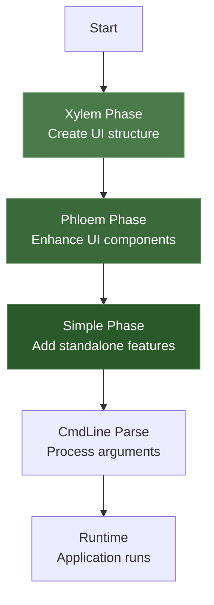
 
**Why This Order Matters:**
 
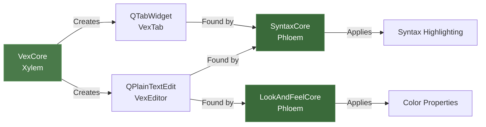
 
**If order were reversed:**
- SyntaxCore would fail to find "VexEditor" (doesn't exist yet)
- LookAndFeelCore would have no widgets to style
- Plugin loading will be more messed up.
- Application could crash silently or malfunction but in most of case the core crash handler prevents it.
 
---
 
## 3. CorePlugin Interface
 
### 3.1 Interface Definition
 
```cpp
class CorePlugin {
public:
    virtual ~CorePlugin() = default;
    
    // Return plugin metadata (importance tier)
    virtual PluginMetadata meta() const = 0;
    
    // Initialize plugin with Vex components
    virtual bool initialize(MainWindow* window, 
                          Settings* settings, 
                          CmdLine& cmdLine) = 0;
};
 
Q_DECLARE_INTERFACE(CorePlugin, "vex.core/4.0")
```
 
**Key Points:**
- Pure virtual interface (abstract base class)
- Must be implemented by all plugins
- `Q_DECLARE_INTERFACE` registers with Qt's meta-object system
- Interface version string: `"vex.core/4.0"`
 
---
 
### 3.2 PluginMetadata Structure
 
```cpp
struct PluginMetadata {
    enum Importance {
        Xylem,   // Structural (UI framework)
        Phloem,  // Enhancement (features)
        Simple   // Standalone (tools)
    };
    
    Importance importance;
};
```
 
**Usage:**
```cpp
PluginMetadata meta() const override {
    PluginMetadata metadata;
    metadata.importance = PluginMetadata::Phloem;
    return metadata;
}
```
 
---
 
### 3.3 Required Methods
 
**1. meta() - Plugin Metadata**
```cpp
PluginMetadata meta() const override;
```
- Returns plugin importance tier
- Called during categorization phase
- Determines initialization order
 
**2. initialize() - Plugin Initialization**
```cpp
bool initialize(MainWindow* window, 
                Settings* settings, 
                CmdLine& cmdLine) override;
```
- Called once during startup
- Receives core Vex components
- Return `true` on success, `false` on failure
- Failures logged in debug mode
 
---
 
### 3.4 Initialization Parameters
 
**MainWindow* window:**
- Pointer to Vex's main window (QMainWindow)
- Use to find child widgets
- Add menus, toolbars, actions
- Access status bar
 
**Settings* settings:**
- Pointer to Vex's settings system
- Persistent key-value storage
- Configuration management
- User preferences
 
**CmdLine& cmdLine:**
- Reference to command-line interface
- Add custom flags/arguments
- Parse command-line options
- Access launch parameters
 
---
 
## 4. Creating a Core Plugin
 
### 4.1 Plugin File Structure
 
```
MyPlugin/
├── MyPlugin.cxx          # Plugin implementation
├── MyPlugin.H            # Optional header (if needed)
├── CMakeLists.txt        # Build configuration
└── resources.qrc         # Optional Qt resources
```
 
**Minimal Structure:**
```
MyPlugin.cxx              # Single file plugin
```
 
---
 
### 4.2 Basic Plugin Template
 
```cpp
#include <QObject>
#include <QtPlugin>
#include <QMainWindow>
#include <QMessageBox>
#include "Plugvex.H"
#include "Settings.H"
 
class MyPlugin : public QObject, public CorePlugin {
    Q_OBJECT
    Q_PLUGIN_METADATA(IID "vex.core/4.0")
    Q_INTERFACES(CorePlugin)
 
public:
    PluginMetadata meta() const override {
        PluginMetadata metadata;
        metadata.importance = PluginMetadata::Simple;
        return metadata;
    }
 
    bool initialize(MainWindow* window, Settings* settings, CmdLine& cmdLine) override {
        Q_UNUSED(settings)
        Q_UNUSED(cmdLine)
        
        m_mainWindow = reinterpret_cast<QMainWindow*>(window);
        
        // Your initialization code here
        m_mainWindow->statusBar()->showMessage("MyPlugin loaded!", 2000);
        
        return true;
    }
 
private:
    QMainWindow* m_mainWindow{nullptr};
};
 
#include "MyPlugin.moc"
```
 
**Key Components:**
 
1. **Include QObject and Plugin Macros:**
   ```cpp
   #include <QObject>
   #include <QtPlugin>
   ```
 
2. **Inherit from QObject and CorePlugin:**
   ```cpp
   class MyPlugin : public QObject, public CorePlugin
   ```
 
3. **Add Qt Macros:**
   ```cpp
   Q_OBJECT
   Q_PLUGIN_METADATA(IID "vex.core/4.0")
   Q_INTERFACES(CorePlugin)
   ```
 
4. **Implement Interface:**
   ```cpp
   PluginMetadata meta() const override { ... }
   bool initialize(...) override { ... }
   ```
 
5. **Include MOC File:**
   ```cpp
   #include "MyPlugin.moc"
   ```
 
---
 
### 4.3 Build Configuration (CMake)
 
**CMakeLists.txt:**
```cmake
cmake_minimum_required(VERSION 3.16)
project(MyPlugin LANGUAGES CXX)
 
set(CMAKE_AUTOMOC ON)
set(CMAKE_CXX_STANDARD 20)
set(CMAKE_CXX_STANDARD_REQUIRED ON)
 
find_package(Qt6 REQUIRED COMPONENTS Core Widgets)
 
# Create shared library
add_library(MyPlugin SHARED MyPlugin.cxx)
 
# Link Qt libraries
target_link_libraries(MyPlugin PRIVATE 
    Qt6::Core 
    Qt6::Widgets
)
 
# Include Vex headers (Plugvex.H, Settings.H)
target_include_directories(MyPlugin PRIVATE 
    ${CMAKE_CURRENT_SOURCE_DIR}/../..
)
 
# Remove 'lib' prefix
set_target_properties(MyPlugin PROPERTIES PREFIX "")
 
# Platform-specific output
if(WIN32 OR APPLE)
    set_target_properties(MyPlugin PROPERTIES
        RUNTIME_OUTPUT_DIRECTORY "${CMAKE_BINARY_DIR}"
        LIBRARY_OUTPUT_DIRECTORY "${CMAKE_BINARY_DIR}"  
    )
endif()
```
 
**Build:**
```bash
mkdir build
cd build
cmake ..
make
```
 
**Output:**
- Linux: `MyPlugin.so`
- Windows: `MyPlugin.dll`
- macOS: `MyPlugin.dylib`
 
---
 
### 4.4 Plugin Metadata
 
**Choosing Importance Tier:**
 
| Choose Xylem if: | Choose Phloem if: | Choose Simple if: |
|------------------|-------------------|-------------------|
| Creates main UI widgets | Enhances existing widgets | Standalone feature |
| Provides structure for others | Depends on Xylem widgets | No dependencies |
| Must load first | Must load after Xylem | Load order doesn't matter |
| Example: Tab system | Example: Syntax highlighter | Example: Terminal |
 
**Example Decisions:**
```cpp
// VexCore - creates fundamental UI
PluginMetadata::Xylem
 
// SyntaxCore - enhances editor widgets
PluginMetadata::Phloem
 
// TerminalPlugin - standalone tool
PluginMetadata::Simple
```
 
---
 
### 4.5 Qt Plugin System Integration
 
**Required Qt Macros:**
 
```cpp
Q_OBJECT
```
- Enables Qt's meta-object system
- Required for signals/slots
- Required for all QObject-derived classes
 
```cpp
Q_PLUGIN_METADATA(IID "vex.core/4.0")
```
- Declares plugin interface version
- Must match `Q_DECLARE_INTERFACE` in Plugvex.H
- Enables Qt plugin loader to recognize the plugin
 
```cpp
Q_INTERFACES(CorePlugin)
```
- Declares which interface(s) the class implements
- Allows `qobject_cast<CorePlugin*>()` to work
- Required for plugin loading
 
---
 
## 5. Plugin Discovery and Loading
 
### 5.1 Plugin Search Paths
 
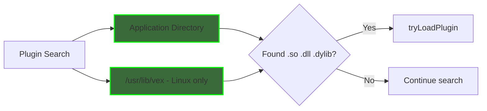
 
**Search Order:**
1. **Application directory** (where vex executable is)
   - Linux: `/usr/bin/` or build directory
   - Windows: `C:\Program Files\Vex\`
   - macOS: `/Applications/Vex.app/Contents/MacOS/`
 
2. **/usr/lib/vex** (Linux only)
   - System-wide plugin installation
   - Requires root/sudo to install
 
**Code:**
```cpp
QStringList paths;
paths << QCoreApplication::applicationDirPath();
 
#if defined(Q_OS_UNIX) && !defined(Q_OS_DARWIN)
    paths << "/usr/lib/vex";
#endif
```
 
---
 
### 5.2 Platform-Specific Extensions
 
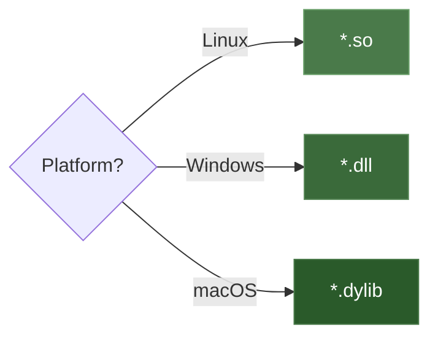
 
**Extension Detection:**
```cpp
QStringList getPluginExtensions() {
    QStringList extensions;
#ifdef Q_OS_WIN
    extensions << "*.dll";
#elif defined(Q_OS_MAC)
    extensions << "*.dylib";
#else
    extensions << "*.so";
#endif
    return extensions;
}
```
 
---
 
### 5.3 Loading Process
 
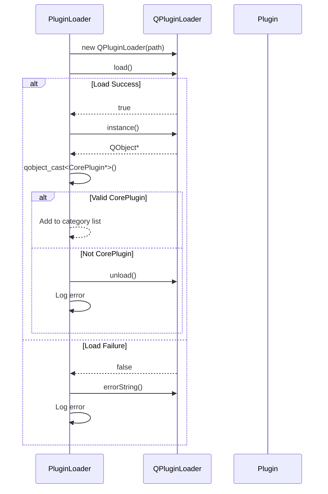
 
**Code:**
```cpp
QPluginLoader* tryLoadPlugin(const QString& path, QList<PluginError>& errors) {
    QPluginLoader* loader = new QPluginLoader(path);
    
    if (!loader->load()) {
        errors.append({filename, loader->errorString()});
        delete loader;
        return nullptr;
    }
    
    QObject* instance = loader->instance();
    if (!instance) {
        errors.append({filename, "Plugin created no instance"});
        loader->unload();
        delete loader;
        return nullptr;
    }
    
    CorePlugin* plugin = qobject_cast<CorePlugin*>(instance);
    if (!plugin) {
        errors.append({filename, "Not a valid CorePlugin interface"});
        loader->unload();
        delete loader;
        return nullptr;
    }
    
    return loader;
}
```
 
---
 
### 5.4 Error Handling
 
**Error Types:**
 
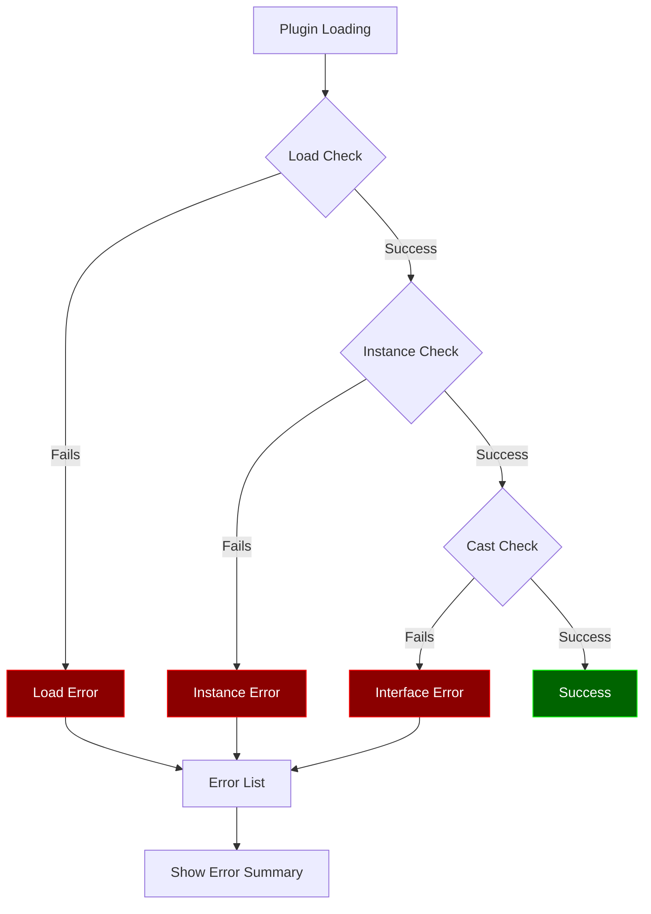
 
**Error Structure:**
```cpp
struct PluginError {
    QString filename;
    QString error;
};
```
 
**Error Summary (Debug Mode):**
```cpp
void showErrorSummary(const QList<PluginError>& errors) {
    if (!Debug_Mode) return;
    
    QString summary = QString("Failed to load %1 plugin(s):\n\n")
                             .arg(errors.size());
    
    for (const auto& err : errors) {
        summary += QString("• %1\n  %2\n\n")
                          .arg(err.filename, err.error);
    }
    
    QMessageBox::warning(nullptr, "Plugin Load Errors", summary);
}
```
 
---
 
## 6. Command Line Interface (CmdLine)
 
### 6.1 CmdLine System
 
The `CmdLine` class provides a unified command-line argument system for Vex and all plugins.
 
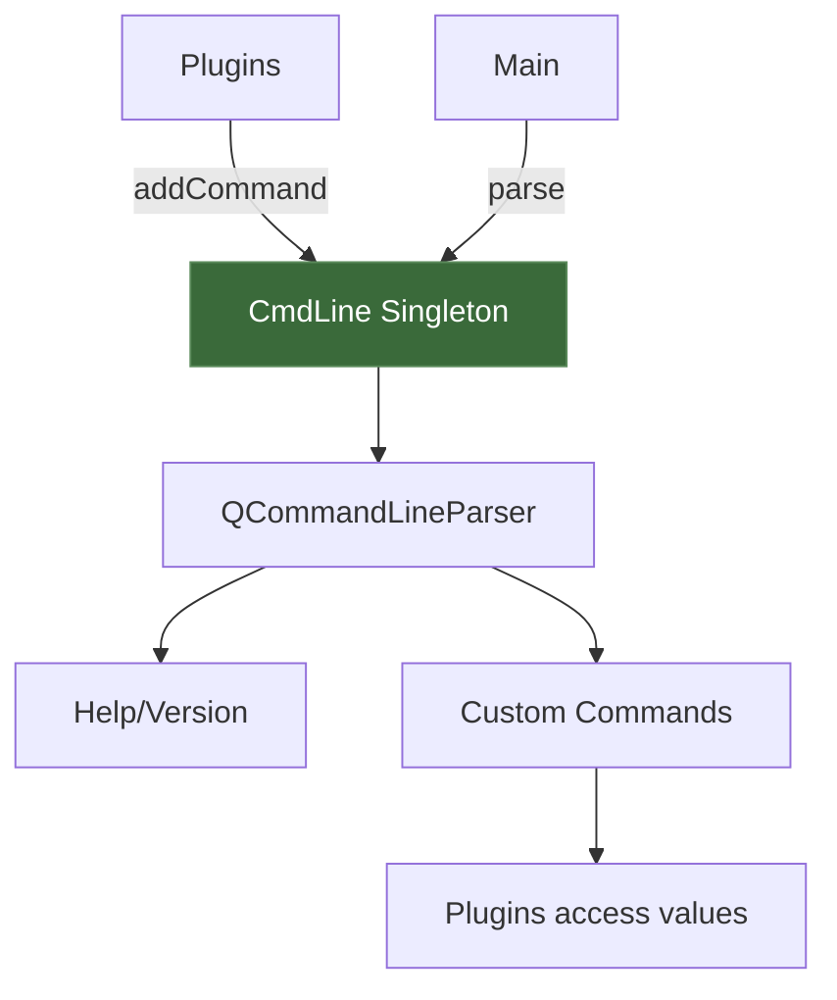
 
**Key Features:**
- **Singleton Pattern**: One instance shared by all plugins
- **Command Registration**: Plugins register before parse()
- **Multiple Aliases**: Commands can have multiple names
- **Help Generation**: Automatic help text formatting
- **Flag Arguments**: Advanced argument parsing
 
---
 
### 6.2 Adding Commands
 
**Command Structure:**
```cpp
struct CMD {
    QStringList names;   // Command aliases
    QString help;        // Help description
    QString value;       // Value placeholder (empty for flags)
};
```
 
**Adding a Command:**
```cpp
bool initialize(MainWindow* window, Settings* settings, CmdLine& cmdLine) override {
    // Add a flag (no value)
    cmdLine.addCommand({{"v", "verbose"}, "Enable verbose output", ""});
    
    // Add a valued option
    cmdLine.addCommand({{"o", "output"}, "Output file path", "file"});
    
    // Add with multiple aliases
    cmdLine.addCommand({{"t", "theme", "style"}, "Theme name", "name"});
    
    return true;
}
```
 
**Built-in Commands:**
```cpp
// Registered by PluginLoader
cmdLine.addCommand({{"d", "debug"}, "Enable debug mode", ""});
 
// Automatic Qt commands
--help, -h         Show help
--version          Show version
```
 
---
 
### 6.3 Parsing Arguments
 
**Parse Flow:**
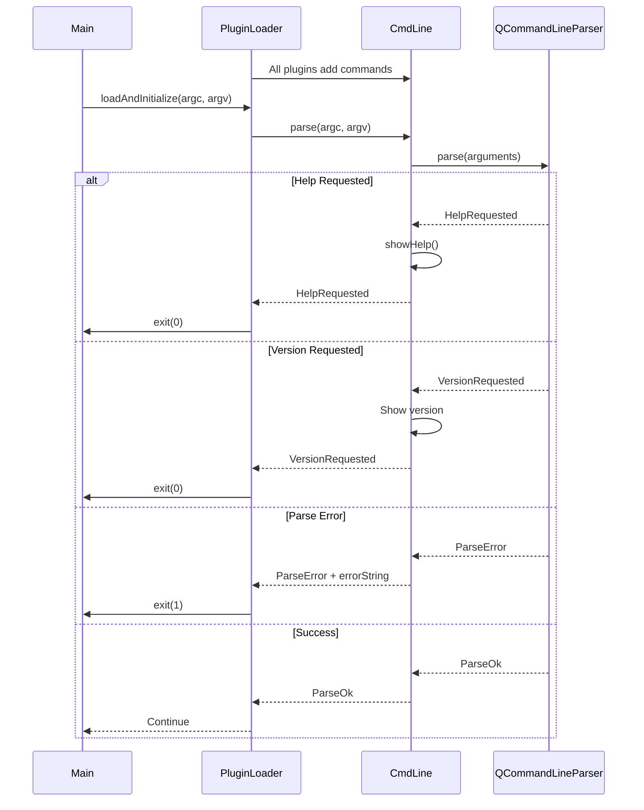
 
**Parse Results:**
```cpp
enum ParseResult {
    ParseOk,            // Successful parse
    ParseError,         // Invalid arguments
    HelpRequested,      // --help flag
    VersionRequested    // --version flag
};
```
 
---
 
### 6.4 Accessing Values
 
**Checking if Set:**
```cpp
if (cmdLine.isSet("verbose")) {
    qDebug() << "Verbose mode enabled";
}
 
if (cmdLine.isSet("debug")) {
    Debug_Mode = true;
}
```
 
**Getting Values:**
```cpp
QString output = cmdLine.value("output");
if (!output.isEmpty()) {
    qDebug() << "Output file:" << output;
}
 
QString theme = cmdLine.value("theme");
applyTheme(theme);
```
 
**Positional Arguments:**
```cpp
// vex file1.txt file2.txt
QStringList files = cmdLine.positionalArgs();
for (const QString &file : files) {
    openFile(file);
}
```
 
---
 
### 6.5 Flag Arguments
 
**Advanced Feature**: Get all arguments after a flag
 
**Example:**
```bash
vex --open file1.txt file2.txt file3.txt --theme dark
```
 
**Access:**
```cpp
// Get all files after --open
QStringList files = cmdLine.flagArgs("open");
// Returns: ["file1.txt", "file2.txt", "file3.txt"]
 
// Get theme value
QString theme = cmdLine.flagArgs("theme");
// Returns: ["dark"]
```
 
**Use Cases:**
- Multiple file opening
- List-based arguments
- Complex command structures
 
---
 
## 7. Accessing Vex Components
 
### 7.1 MainWindow Access
 
**Receiving MainWindow:**
```cpp
bool initialize(MainWindow* window, Settings* settings, CmdLine& cmdLine) override {
    m_mainWindow = reinterpret_cast<QMainWindow*>(window);
    return true;
}
```
 
**Why reinterpret_cast?**
- `MainWindow` is forward-declared in Plugvex.H
- Full definition is in main.cxx
- Plugins don't have access to full class definition
- `reinterpret_cast` treats it as `QMainWindow*`
 
**Common Operations:**
```cpp
// Access menu bar
QMenuBar* menuBar = m_mainWindow->menuBar();
 
// Access status bar
QStatusBar* statusBar = m_mainWindow->statusBar();
statusBar->showMessage("Plugin initialized", 2000);
 
// Set central widget
m_mainWindow->setCentralWidget(myWidget);
 
// Window properties
m_mainWindow->setWindowTitle("Vex - My Plugin");
```
 
---
 
### 7.2 Finding Child Widgets
 
**By Object Name:**
```cpp
// Find QTabWidget named "VexTab"
QTabWidget* tabs = m_mainWindow->findChild<QTabWidget*>("VexTab");
if (tabs) {
    int count = tabs->count();
    qDebug() << "Found" << count << "tabs";
}
 
// Find QStackedWidget
QStackedWidget* stack = m_mainWindow->findChild<QStackedWidget*>("VexStack");
```
 
**Find Multiple Widgets:**
```cpp
// Find all QPlainTextEdit with objectName "VexEditor"
QList<QPlainTextEdit*> editors = 
    tabs->findChildren<QPlainTextEdit*>("VexEditor");
 
for (QPlainTextEdit* editor : editors) {
    // Apply settings to each editor
    editor->setFont(codeFont);
}
```
 
**Widget Hierarchy:**
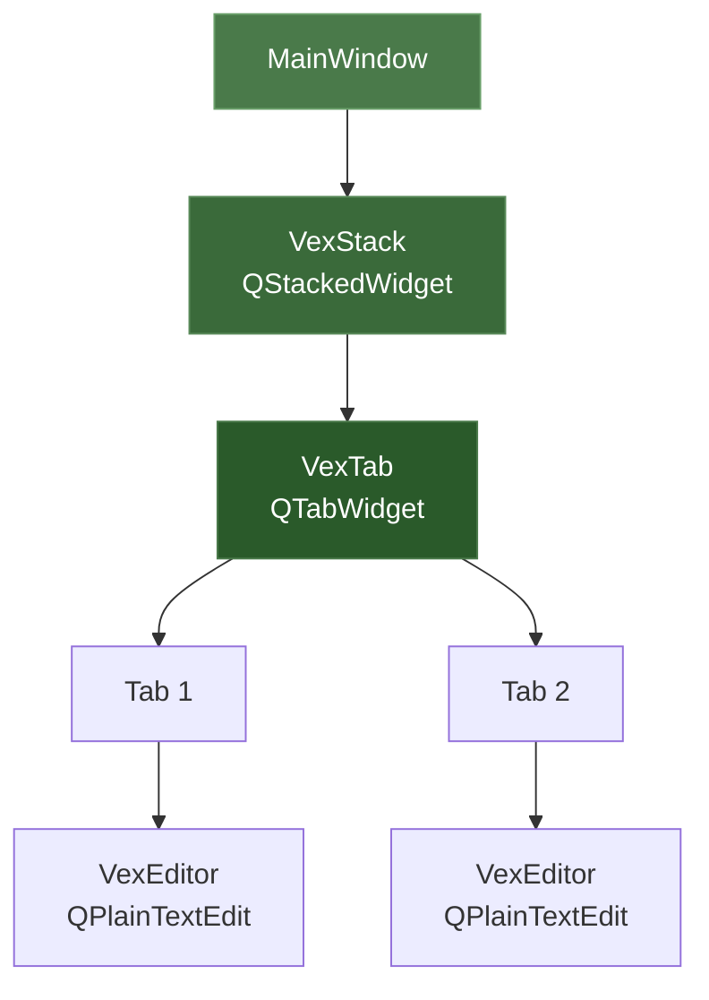
 
---
 
### 7.3 Settings System
 
**Singleton Access:**
```cpp
Settings& settings = Settings::instance();
```
 
**Storing Values:**
```cpp
// Store string
settings.setValue("currentTheme", "dark.qss");
 
// Store integer
settings.setValue("fontSize", 12);
 
// Store boolean
settings.setValue("showLineNumbers", true);
 
// Store complex types
QStringList recentFiles = {"file1.txt", "file2.cpp"};
settings.setValue("recentFiles", recentFiles);
```
 
**Retrieving Values:**
```cpp
// With default value
QString theme = settings.get<QString>("currentTheme", "default.qss");
int fontSize = settings.get<int>("fontSize", 12);
bool showLineNumbers = settings.get<bool>("showLineNumbers", true);
 
// Check if exists
if (settings.contains("currentTheme")) {
    QString theme = settings.get<QString>("currentTheme");
}
```
 
**Removing Values:**
```cpp
settings.remove("oldSetting");
```
 
**Settings File Location:**
```
~/.vex/vex.conf
```
 
**File Format (INI):**
```ini
[General]
currentTheme=dark.qss
fontSize=12
showLineNumbers=true
```
 
---
 
### 7.4 Menu Integration
 
**Finding Existing Menu:**
```cpp
QMenuBar* menuBar = m_mainWindow->menuBar();
QList<QAction*> actions = menuBar->actions();
 
QMenu* viewMenu = nullptr;
for (QAction* action : actions) {
    if (action->text() == "&View" || action->text() == "View") {
        viewMenu = action->menu();
        break;
    }
}
```
 
**Creating New Menu:**
```cpp
if (!viewMenu) {
    viewMenu = menuBar->addMenu("&View");
}
```
 
**Adding Menu Items:**
```cpp
// Add action
QAction* action = viewMenu->addAction("My Feature");
connect(action, &QAction::triggered, this, &MyPlugin::onFeatureTriggered);
 
// Add with shortcut
QAction* toggleAction = viewMenu->addAction("Toggle Feature");
toggleAction->setShortcut(QKeySequence("Ctrl+Shift+T"));
toggleAction->setCheckable(true);
 
// Add separator
viewMenu->addSeparator();
 
// Add submenu
QMenu* subMenu = viewMenu->addMenu("Sub Features");
subMenu->addAction("Feature 1");
subMenu->addAction("Feature 2");
```
 
**Action Groups (Mutually Exclusive):**
```cpp
QActionGroup* group = new QActionGroup(this);
group->setExclusive(true);
 
QAction* opt1 = menu->addAction("Option 1");
opt1->setCheckable(true);
group->addAction(opt1);
 
QAction* opt2 = menu->addAction("Option 2");
opt2->setCheckable(true);
group->addAction(opt2);
 
connect(group, &QActionGroup::triggered, 
        this, &MyPlugin::onOptionChanged);
```
 
---
 
### 7.5 Status Bar Integration
 
**Simple Messages:**
```cpp
QStatusBar* statusBar = m_mainWindow->statusBar();
 
// Temporary message (2 seconds)
statusBar->showMessage("Operation completed", 2000);
 
// Permanent message
statusBar->showMessage("Ready");
 
// Clear message
statusBar->clearMessage();
```
 
**Permanent Widgets:**
```cpp
// Add label
QLabel* label = new QLabel("Status: Ready");
statusBar->addPermanentWidget(label);
 
// Add at specific position
statusBar->insertPermanentWidget(0, label);
 
// Add combo box (like language selector)
QComboBox* combo = new QComboBox();
combo->setObjectName("MyCombo");
combo->addItems({"Option 1", "Option 2"});
statusBar->addPermanentWidget(combo);
```
 
**Example: Language Selector**
```cpp
selector = new QComboBox(m_mainWindow);
selector->setObjectName("SyntaxLanguageSelector");
selector->setToolTip("Select syntax highlighting");
selector->addItem("Auto");
selector->addItem("Python");
selector->addItem("C++");
 
m_mainWindow->statusBar()->insertPermanentWidget(0, selector);
 
connect(selector, QOverload<int>::of(&QComboBox::currentIndexChanged),
        this, &MyPlugin::onLanguageChanged);
```
 
---
 
## 8. Built-in Core Plugins
 
### 8.1 VexCore Plugin
 
**Importance:** Xylem (Structural)
 
**Responsibilities:**
- Create main UI structure
- Tab widget system
- Text editor widgets
- File operations
- Basic editing functionality
 
**Key Components:**
```cpp
QStackedWidget* stack = new QStackedWidget();
stack->setObjectName("VexStack");
 
QTabWidget* tabs = new QTabWidget();
tabs->setObjectName("VexTab");
 
QPlainTextEdit* editor = new QPlainTextEdit();
editor->setObjectName("VexEditor");
```
 
**Provides for Other Plugins:**
- `VexStack` - Main stacked widget container
- `VexTab` - Tab system for multiple files
- `VexEditor` - Text editor instances
 
---
 
### 8.2 SyntaxCore Plugin
 
**Importance:** Phloem (Enhancement)
 
**Responsibilities:**
- Syntax highlighting system
- Language detection
- .vxsyn file parsing
- TextPainter integration
- Language selector UI
 
**Dependencies:**
- Requires `VexTab` (from VexCore)
- Requires `VexEditor` instances (from VexCore)
 
**Key Features:**
- Dynamic syntax file loading
- Hot reload support
- Multi-language support
- File extension matching
- Content-based detection
 
**See:** [Vex Syntax Documentation](vxsyn-documentation.md)
 
---
 
### 8.3 LookAndFeelCore Plugin
 
**Importance:** Phloem (Enhancement)
 
**Responsibilities:**
- Theme system (QSS)
- Icon theme management
- Qt style selection
- VEX#QSS custom properties
- Hot reload support
 
**Dependencies:**
- Can work independently
- Enhances `VexEditor` if present
 
**Key Features:**
- Custom VEX#QSS block parsing
- Syntax color integration
- Theme hot reloading
- Icon resolution system
- File watcher integration
 
**See:** [Vex Theming Guide](vex-theming-guide.md)
 
---
 
## 9. Advanced Plugin Development
 
### 9.1 Inter-Plugin Communication
 
**Event System:**
```cpp
// Define custom event
class MyCustomEvent : public QEvent {
public:
    static const QEvent::Type eventType = 
        static_cast<QEvent::Type>(QEvent::User + 1001);
    
    MyCustomEvent(const QString& data)
        : QEvent(eventType), m_data(data) {}
    
    QString data() const { return m_data; }
    
private:
    QString m_data;
};
 
// Send event (from one plugin)
MyCustomEvent* event = new MyCustomEvent("Hello from Plugin A");
QApplication::postEvent(m_mainWindow, event);
 
// Receive event (in another plugin)
bool eventFilter(QObject* obj, QEvent* event) override {
    if (event->type() == MyCustomEvent::eventType) {
        MyCustomEvent* myEvent = static_cast<MyCustomEvent*>(event);
        qDebug() << "Received:" << myEvent->data();
        return true;
    }
    return false;
}
 
// Install event filter
m_mainWindow->installEventFilter(this);
```
 
**Shared Object Access:**
```cpp
// Plugin A creates a shared widget
QWidget* sharedWidget = new QWidget();
sharedWidget->setObjectName("SharedData");
sharedWidget->setProperty("pluginAData", QVariant::fromValue(myData));
 
// Plugin B accesses shared widget
QWidget* shared = m_mainWindow->findChild<QWidget*>("SharedData");
if (shared) {
    QVariant data = shared->property("pluginAData");
    // Use data
}
```
 
---
 
### 9.2 Qt Signals and Slots
 
**Connecting to Qt Signals:**
```cpp
// Connect to tab change
QTabWidget* tabs = m_mainWindow->findChild<QTabWidget*>("VexTab");
if (tabs) {
    connect(tabs, &QTabWidget::currentChanged,
            this, &MyPlugin::onTabChanged);
}
 
// Connect to text change
QPlainTextEdit* editor = findCurrentEditor();
if (editor) {
    connect(editor, &QPlainTextEdit::textChanged,
            this, &MyPlugin::onTextChanged);
}
```
 
**Creating Custom Signals:**
```cpp
class MyPlugin : public QObject, public CorePlugin {
    Q_OBJECT
    
signals:
    void dataProcessed(const QString& result);
    void errorOccurred(const QString& error);
    
public slots:
    void processData(const QString& input) {
        // Process data
        if (success) {
            emit dataProcessed(result);
        } else {
            emit errorOccurred(errorMsg);
        }
    }
};
```
 
---
 
### 9.3 Event System Integration
 
**Custom Event Example (from LookAndFeelCore):**
```cpp
class SyntaxColorEvent : public QEvent {
public:
    static const QEvent::Type eventType = 
        static_cast<QEvent::Type>(QEvent::User + 1000);
    
    SyntaxColorEvent(const QMap<QString, QColor>& colors)
        : QEvent(eventType), m_colors(colors) {}
    
    QMap<QString, QColor> colors() const { return m_colors; }
    
private:
    QMap<QString, QColor> m_colors;
};
 
// Send colors to SyntaxCore
SyntaxColorEvent* event = new SyntaxColorEvent(syntaxColors);
QApplication::postEvent(m_mainWindow, event);
```
 
**Receiving Custom Events:**
```cpp
// In SyntaxCore or any plugin
bool event(QEvent* event) override {
    if (event->type() == SyntaxColorEvent::eventType) {
        SyntaxColorEvent* colorEvent = 
            static_cast<SyntaxColorEvent*>(event);
        updateColors(colorEvent->colors());
        return true;
    }
    return QObject::event(event);
}
```
 
---
 
### 9.4 File Watching
 
**QFileSystemWatcher Integration:**
```cpp
class MyPlugin : public QObject, public CorePlugin {
    Q_OBJECT
    
public:
    bool initialize(MainWindow* window, Settings* settings, CmdLine& cmdLine) override {
        m_watcher = new QFileSystemWatcher(this);
        
        QString configPath = Settings::basePath() + "/myconfig";
        m_watcher->addPath(configPath);
        
        connect(m_watcher, &QFileSystemWatcher::directoryChanged,
                this, &MyPlugin::onDirectoryChanged);
        connect(m_watcher, &QFileSystemWatcher::fileChanged,
                this, &MyPlugin::onFileChanged);
        
        return true;
    }
    
private slots:
    void onDirectoryChanged(const QString& path) {
        qDebug() << "Directory changed:" << path;
        reloadConfig();
    }
    
    void onFileChanged(const QString& path) {
        qDebug() << "File changed:" << path;
        
        // Re-add if deleted
        if (!m_watcher->files().contains(path)) {
            m_watcher->addPath(path);
        }
        
        reloadFile(path);
    }
    
private:
    QFileSystemWatcher* m_watcher{nullptr};
};
```
 
---
 
### 9.5 Dynamic UI Creation
 
**Creating Complex Widgets:**
```cpp
class MyPlugin : public QObject, public CorePlugin {
public:
    bool initialize(MainWindow* window, Settings* settings, CmdLine& cmdLine) override {
        m_mainWindow = reinterpret_cast<QMainWindow*>(window);
        
        // Create dock widget
        QDockWidget* dock = new QDockWidget("My Tool", m_mainWindow);
        dock->setObjectName("MyPluginDock");
        
        // Create content widget
        QWidget* content = new QWidget();
        QVBoxLayout* layout = new QVBoxLayout(content);
        
        QPushButton* btn1 = new QPushButton("Action 1");
        QPushButton* btn2 = new QPushButton("Action 2");
        QTextEdit* output = new QTextEdit();
        
        layout->addWidget(btn1);
        layout->addWidget(btn2);
        layout->addWidget(output);
        
        dock->setWidget(content);
        
        // Add to main window
        m_mainWindow->addDockWidget(Qt::RightDockWidgetArea, dock);
        
        // Connect signals
        connect(btn1, &QPushButton::clicked, this, &MyPlugin::onAction1);
        connect(btn2, &QPushButton::clicked, this, &MyPlugin::onAction2);
        
        return true;
    }
};
```
 
---
 
## 10. Plugin Possibilities
 
### 10.1 Editor Extensions
 
**Line Numbers:**
```cpp
class LineNumberPlugin : public QObject, public CorePlugin {
    // Add line number area to QPlainTextEdit
    // Paint line numbers in gutter
    // Handle scrolling and updates
};
```
 
**Minimap:**
```cpp
class MinimapPlugin : public QObject, public CorePlugin {
    // Create minimap widget
    // Render scaled-down version of editor
    // Handle scrolling synchronization
};
```
 
**Autocomplete:**
```cpp
class AutocompletePlugin : public QObject, public CorePlugin {
    // Monitor text input
    // Show completion popup
    // Language-specific completions
};
```
 
**Bracket Matching:**
```cpp
class BracketMatchPlugin : public QObject, public CorePlugin {
    // Highlight matching brackets
    // Handle multiple bracket types
    // Show mismatch errors
};
```
 
---
 
### 10.2 Language Support
 
**Language Server Protocol (LSP):**
```cpp
class LSPPlugin : public QObject, public CorePlugin {
    // Connect to language servers
    // Provide code intelligence
    // Show diagnostics
    // Handle completions, hover, definitions
};
```
 
**Linting:**
```cpp
class LinterPlugin : public QObject, public CorePlugin {
    // Run external linters
    // Parse lint output
    // Display inline warnings/errors
    // Configurable rules
};
```
 
**Formatting:**
```cpp
class FormatterPlugin : public QObject, public CorePlugin {
    // Integration with clang-format, prettier, etc.
    // Format on save
    // Custom formatting rules
};
```
 
---
 
### 10.3 Version Control Integration
 
**Git Integration:**
```cpp
class GitPlugin : public QObject, public CorePlugin {
    // Show git status in UI
    // Diff viewer
    // Commit/push/pull
    // Branch management
    // Blame annotations
};
```
 
**Diff Viewer:**
```cpp
class DiffViewerPlugin : public QObject, public CorePlugin {
    // Side-by-side diff view
    // Inline diff markers
    // Navigate changes
    // Merge conflict resolution
};
```
 
---
 
### 10.4 Build System Integration
 
**CMake Integration:**
```cpp
class CMakePlugin : public QObject, public CorePlugin {
    // Parse CMakeLists.txt
    // Configure/build/run
    // Target selection
    // Build output parsing
};
```
 
**Makefile Integration:**
```cpp
class MakePlugin : public QObject, public CorePlugin {
    // Parse Makefiles
    // Run make targets
    // Error parsing
    // Build status
};
```
 
---
 
### 10.5 Terminal Integration
 
**Embedded Terminal:**
```cpp
class TerminalPlugin : public QObject, public CorePlugin {
    Q_OBJECT
    Q_PLUGIN_METADATA(IID "vex.core/4.0")
    Q_INTERFACES(CorePlugin)
    
public:
    PluginMetadata meta() const override {
        PluginMetadata metadata;
        metadata.importance = PluginMetadata::Simple;
        return metadata;
    }
    
    bool initialize(MainWindow* window, Settings* settings, CmdLine& cmdLine) override {
        m_mainWindow = reinterpret_cast<QMainWindow*>(window);
        
        // Create terminal dock
        QDockWidget* termDock = new QDockWidget("Terminal", m_mainWindow);
        
        // Embed terminal (pseudo-terminal on Unix, ConPTY on Windows)
        m_terminal = createTerminalWidget();
        termDock->setWidget(m_terminal);
        
        m_mainWindow->addDockWidget(Qt::BottomDockWidgetArea, termDock);
        
        return true;
    }
};
```
 
---
 
### 10.6 Project Management
 
**Project Explorer:**
```cpp
class ProjectExplorerPlugin : public QObject, public CorePlugin {
    // Tree view of project files
    // File navigation
    // File operations (create, delete, rename)
    // Search in project
};
```
 
**Session Management:**
```cpp
class SessionPlugin : public QObject, public CorePlugin {
    // Save/restore open files
    // Save cursor positions
    // Save window layout
    // Multiple sessions
};
```
 
---
 
### 10.7 Code Intelligence
 
**Symbol Navigator:**
```cpp
class SymbolNavigatorPlugin : public QObject, public CorePlugin {
    // Parse source files
    // Show functions, classes, variables
    // Jump to definition
    // Find references
};
```
 
**Code Outline:**
```cpp
class OutlinePlugin : public QObject, public CorePlugin {
    // Show document structure
    // Collapsible sections
    // Quick navigation
};
```
 
---
 
### 10.8 Debugging
 
**Debugger Integration:**
```cpp
class DebuggerPlugin : public QObject, public CorePlugin {
    // GDB/LLDB integration
    // Breakpoint management
    // Step through code
    // Variable inspection
    // Call stack view
};
```
 
---
 
## 11. Debug Mode
 
### 11.1 Enabling Debug Mode
 
**Command Line:**
```bash
vex --debug
vex -d
```
 
**Code:**
```cpp
cmdLine.addCommand({{"d", "debug"}, "Enable debug mode", ""});
 
// After parse
Debug_Mode = cmdLine.isSet("debug");
```
 
**Programmatic:**
```cpp
PluginLoader::setDebugMode(true);
```
 
---
 
### 11.2 Debug Output
 
**Debug Logging:**
```cpp
void Debug_Log(const QString& message) {
    if (Debug_Mode) {
        qDebug() << message;
    }
}
 
// Usage
Debug_Log("Successfully loaded plugin: VexCore.so");
Debug_Log("Initializing Xylem plugins (3 found)");
```
 
**Warning Logging:**
```cpp
void Debug_Warning(const QString& message) {
    if (Debug_Mode) {
        qWarning() << message;
    }
}
 
// Usage
Debug_Warning("Failed to load plugin: BadPlugin.so");
```
 
**Critical Logging:**
```cpp
void Debug_Critical(const QString& message) {
    if (Debug_Mode) {
        qCritical() << message;
    }
}
 
// Usage
Debug_Critical("Plugin threw exception during Phloem phase");
```
 
---
 
### 11.3 Error Dialogs
 
**Error Summary (Debug Mode Only):**
```cpp
if (!errors.isEmpty() && Debug_Mode) {
    showErrorSummary(errors);
}
```
 
**Initialization Failures:**
```cpp
try {
    if (!plugin->initialize(window, settings, cmdLine)) {
        if (Debug_Mode) {
            QMessageBox::warning(nullptr, "Plugin Init Failed",
                "Plugin returned false during initialization");
        }
    }
} catch (const std::exception& e) {
    if (Debug_Mode) {
        QMessageBox::critical(nullptr, "Plugin Exception!",
            QString("Plugin threw exception:\n%1").arg(e.what()));
    }
}
```
 
---
 
## 12. Troubleshooting
 
### 12.1 Plugin Not Loading
 
**Problem:** Plugin file exists but doesn't load.
 
**Solutions:**
 
1. **Check file extension:**
   ```bash
   # Linux
   ls *.so
   
   # Windows
   dir *.dll
   
   # macOS
   ls *.dylib
   ```
 
2. **Check file permissions:**
   ```bash
   chmod 755 MyPlugin.so
   ```
 
3. **Check dependencies:**
   ```bash
   # Linux
   ldd MyPlugin.so
   
   # macOS
   otool -L MyPlugin.dylib
   
   # Windows
   dumpbin /DEPENDENTS MyPlugin.dll
   ```
 
4. **Enable debug mode:**
   ```bash
   vex --debug
   ```
   Check error messages for specific failure reason.
 
5. **Verify interface version:**
   ```cpp
   Q_PLUGIN_METADATA(IID "vex.core/4.0")  // Must match
   ```
 
---
 
### 12.2 Initialization Failures
 
**Problem:** Plugin loads but initialize() returns false.
 
**Debug Steps:**
 
1. **Add debug output:**
   ```cpp
   bool initialize(...) override {
       qDebug() << "MyPlugin: Starting initialization";
       
       if (!m_mainWindow) {
           qDebug() << "MyPlugin: ERROR - Invalid window pointer";
           return false;
       }
       
       qDebug() << "MyPlugin: Initialization successful";
       return true;
   }
   ```
 
2. **Check widget access:**
   ```cpp
   QTabWidget* tabs = m_mainWindow->findChild<QTabWidget*>("VexTab");
   if (!tabs) {
       qDebug() << "MyPlugin: VexTab not found (VexCore not loaded?)";
       return false;
   }
   ```
 
3. **Verify importance tier:**
   - Phloem plugins need Xylem widgets
   - Check if you're trying to access widgets that don't exist yet
 
4. **Check exception handling:**
   - Exceptions are caught and logged in debug mode
   - Use try-catch in your initialize()
 
---
 
### 12.3 Crashes and Isolation
 
**Plugin Isolation:**
```cpp
try {
    if (!plugin->initialize(window, settings, cmdLine)) {
        // Failure logged, continue with other plugins
    }
} catch (const std::exception& e) {
    // Exception caught, other plugins unaffected
    Debug_Critical("Plugin crashed but was isolated");
}
```
 
**Crash Prevention:**
 
1. **Null pointer checks:**
   ```cpp
   if (!m_mainWindow) return false;
   if (!tabs) return false;
   if (!editor) return false;
   ```
 
2. **Defensive programming:**
   ```cpp
   QWidget* widget = m_mainWindow->findChild<QWidget*>("VexStack");
   QStackedWidget* stack = qobject_cast<QStackedWidget*>(widget);
   if (!stack) {
       qDebug() << "VexStack not found or wrong type";
       return false;
   }
   ```
 
3. **Resource cleanup:**
   ```cpp
   ~MyPlugin() {
       if (m_watcher) {
           delete m_watcher;
           m_watcher = nullptr;
       }
   }
   ```
 
---
 
### 12.4 Build Issues
 
**CMake not finding Qt:**
```cmake
# Set Qt path explicitly
set(CMAKE_PREFIX_PATH "/path/to/Qt/6.x/gcc_64")
find_package(Qt6 REQUIRED COMPONENTS Core Widgets)
```
 
**MOC not running:**
```cmake
# Ensure AUTOMOC is on
set(CMAKE_AUTOMOC ON)
 
# Or run moc manually
qt6_wrap_cpp(MOC_FILES MyPlugin.H)
add_library(MyPlugin SHARED MyPlugin.cxx ${MOC_FILES})
```
 
**Missing .moc include:**
```cpp
#include "MyPlugin.moc"  // Must be at end of .cxx file
```
 
**Undefined symbols:**
```bash
# Check if Qt libraries are linked
target_link_libraries(MyPlugin PRIVATE Qt6::Core Qt6::Widgets)
 
# Check for missing includes
#include "Plugvex.H"
#include "Settings.H"
```
 
**Wrong output directory:**
```cmake
# Set output to build directory
if(WIN32 OR APPLE)
    set_target_properties(MyPlugin PROPERTIES
        RUNTIME_OUTPUT_DIRECTORY "${CMAKE_BINARY_DIR}"
        LIBRARY_OUTPUT_DIRECTORY "${CMAKE_BINARY_DIR}"
    )
endif()
```
 
---
 
 